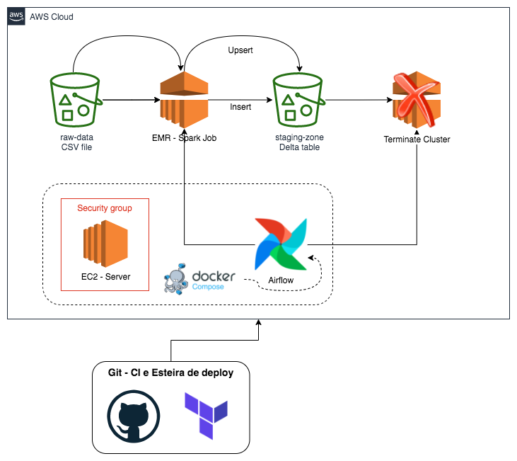

## Big Data Pipeline Orchestration with Airflow

This project was inspired by graduate classes in data engineering. Great part of the material was built using the Rony package and Professor Neylson Crepalde's class codes.

The main idea is building a big data pipeline with task orchestration through Ariflow in an EC2. Tools such as docker comnpose and terraform will be used. A deployment mat will be used through the CI/CD of github workflow. This is a simple architecture and sometimes Airflow could not perform well when we scale the solution. The best archtecture in terms of perform would be using Kurbenetes (K8).

Solution Architecture:

0) Create all the secrets to your gihtub repository.
1) Create a key-pair in EC2.
2) Dont forget to change your account ID inside policy ARN!
3) You must have at least one bucket with your raw data to process.
4) Create pull request on dev branch in order to test all structures in CI/CD
5) Verify at github actions if everything is ok.
6) Check at AWS if all structures and products were created.
7) Get your key.pem and use it to connect via SSSH to server.
8) Inside the server git clone this repository, and go to airflow folder.
9) Run bash install_docker.sh
10) Inside airflow folder, run "docker-compose -f docker-compose-CeleryExecutor.yml up --scale worker=3 -d"
11) Use ariflow from ipv4:8080 address
12) Create airflow variables to connect AWS, key id and access key. You can do it form json or manually.
13) Run terraform init
14) Run terraform destroy (it wont destroy s3 bucket that is not empty)